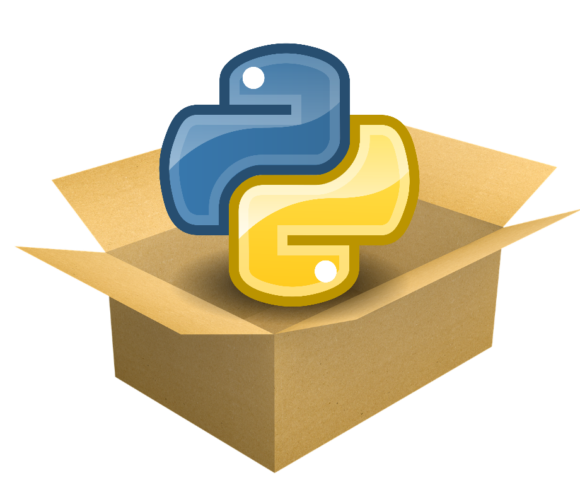

# Repositório de estudos de Criação de Pacotes em Python
Repositório criado para estudar criação de pacotes em Python.

<h1 align="center">
    
</h1>

<h4 align="center"> 
	:construction: Python Package Creating :computer: In progress... :construction:
</h4>
<p align="center">
  

  
	
  <a href="https://www.linkedin.com/in/marcusmarinho/">
    
  </a>

  <a href="https://github.com/marcusmarinhob/dio-criacao-pacotes/commits/master">
    
  </a>

  
   <a href="https://github.com/marcusmarinhob/dio-criacao-pacotes/stargazers">
    
  </a>
</p>


# Calculator

Description.
The package calculator is used to:
  Add
  Subtract
  Multiply
  Divide

## Installation

Use the package manager [pip](https://pip.pypa.io/en/stable) to calculator

```bash
pip install calculator
```

## Author
Marcus Marinho
